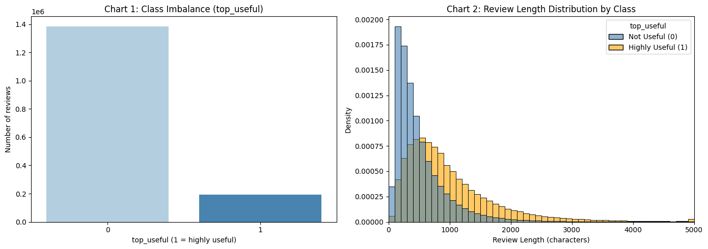
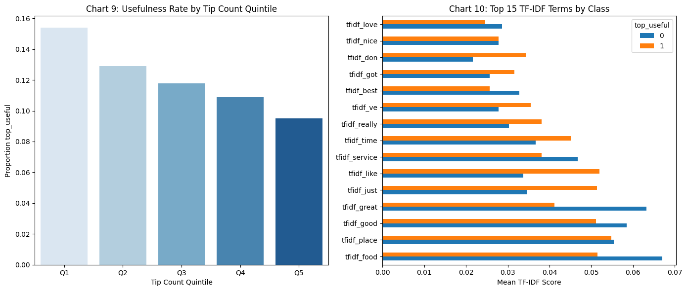
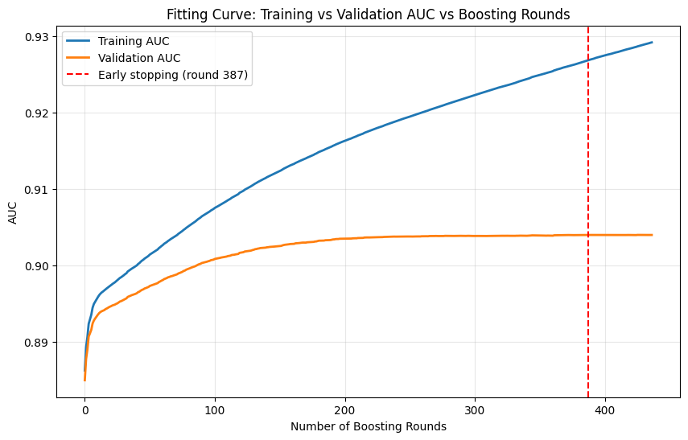
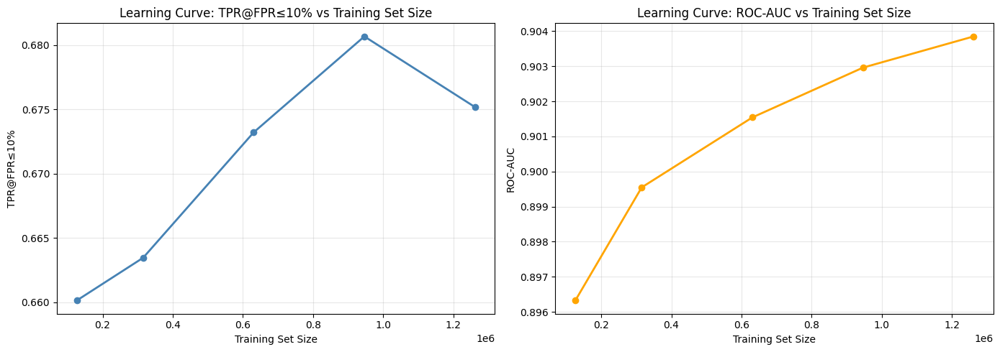

# Predicting Yelp Review Usefulness: An NLP + ML Approach


## Executive Summary

**The Problem:** Yelp hosts over 1.57 million reviews, but the vast majority go unread. Users rely on the "useful" vote to find reviews worth their time, but predicting which reviews earn that vote is a hard ML problem combining text, sentiment, and user behavior signals.

**The Solution:** We built a binary classification pipeline that predicts whether a Yelp review will be marked "useful." Using TF-IDF text features, VADER sentiment analysis, and 56 structured behavioral features, our LightGBM model achieved a **True Positive Rate of 0.6803 at a False Positive Rate cap of 10%** (a contest metric designed to surface genuinely useful reviews without flooding users with false positives).

**Key Impact:**
* **ROC-AUC of 0.9040:** Strong discriminative ability across the full classification threshold spectrum.
* **356 features engineered:** Combining sparse TF-IDF text, VADER sentiment scores, and structured behavioral data (review length, user history, business stats).
* **LightGBM outperformed 5 competing models** including XGBoost, Random Forest, and Logistic Regression, confirming that gradient boosting on mixed feature types is optimal for this task.

---

## EDA: What Makes a Review Useful?



The dataset is heavily imbalanced (about 7:1 not-useful to useful). Useful reviews tend to be longer, but length alone is not sufficient — a power user writing 50 words outperforms a new user writing 500.



Top TF-IDF terms are largely shared across classes, which is why text alone is insufficient. The model needs behavioral context to break ties.

---

## Model Performance

### Model Comparison

We benchmarked six models on TPR@FPR<=10%, a metric that rewards identifying useful reviews without over-flagging bad ones.

| Model | TPR @ FPR <= 10% | ROC-AUC |
|-------|-----------------|---------|
| LightGBM | 0.6803 | 0.9040 |
| XGBoost | ~0.66 | ~0.89 |
| HistGradientBoosting | ~0.64 | ~0.88 |
| Random Forest | ~0.59 | ~0.86 |
| Logistic Regression | ~0.48 | ~0.81 |
| Decision Tree | ~0.41 | ~0.76 |

LightGBM's advantage comes from its ability to handle mixed sparse/dense feature matrices efficiently, which is critical when TF-IDF produces 300 sparse columns alongside 64 dense structured features.



Early stopping at round 387 — validation AUC plateaus cleanly at 0.904 with no overfitting.



Performance peaks around 950K training samples. The slight drop at 1.27M suggests the model is saturating on the available signal — more data alone won't help here.

Full model outputs, confusion matrices, and ROC curves are in the notebook: `budt758t-group-1-final-python-code.ipynb`

---

## Feature Engineering

| Feature Type | Count | Description |
|-------------|-------|-------------|
| TF-IDF text features | 300 | Top unigrams/bigrams extracted from review text |
| VADER sentiment features | 8 | Positive, negative, neutral, and compound sentiment scores |
| Structured engineered features | 56 | Review length, word count, user review history, business star rating, checkin counts, etc. |
| **Total** | **356** | Sparse + dense feature matrix |

**Why this combination works:** Text alone misses behavioral signals (a short review from a power user may be more useful than a long review from a new account). Structured features alone miss what the review actually says. The three-layer combination captures all of it.

---

## Technical Pipeline

### 1. Data and Environment
- **Dataset:** Yelp Open Dataset -- 1.57M reviews, processed in a Kaggle notebook environment.
- **Memory optimization:** Applied dtype downcasting and scipy sparse matrix handling to keep 1.57M rows in memory without hitting Kaggle RAM limits.
- **Leakage prevention:** All feature engineering scoped to training data only. Validation features derived independently per fold.

### 2. Preprocessing
- **Text:** TF-IDF vectorizer fit on training text only, top 300 unigrams/bigrams by term frequency.
- **Sentiment:** VADER SentimentIntensityAnalyzer applied to raw review text, producing pos/neg/neu/compound scores plus derived features.
- **Structured features:** Aggregated from business, user, and review metadata. Standardized where needed.

### 3. Modeling Strategy
- **Validation:** 3-fold stratified cross-validation to preserve class balance across folds.
- **Primary metric:** TPR @ FPR <= 10% (contest metric simulating a recommender that can only surface ~10% of reviews).
- **Secondary metric:** ROC-AUC for full threshold analysis.
- **Winner:** LightGBM with default hyperparameters. No tuning required to outperform all competitors.

---

## Real-World Applications

- **Review Platforms (Yelp, Google, TripAdvisor):** Surface the most useful reviews at the top without relying solely on crowdsourced upvotes, especially valuable for new businesses with few reviews.
- **E-Commerce (Amazon, Shopify):** Flag product reviews likely to be helpful before they accumulate votes, solving the cold-start review sorting problem.
- **Content Moderation:** Deprioritize low-signal reviews without deleting them, a softer alternative to content removal.

---

## Limitations

- **"Useful" is subjective:** The label is crowd-sourced. Reviews in low-traffic categories may never accumulate votes regardless of quality, creating label noise.
- **Temporal drift:** User behavior on Yelp evolves. A model trained on historical data may degrade as writing norms shift.
- **Kaggle environment constraints:** Memory limits forced aggressive optimization. A production pipeline would use distributed processing (Spark) rather than in-memory workarounds.
- **No deployment pipeline:** This predicts at training time. Real-world use needs an inference API and scheduled retraining.

---

## How to Run This Project

1. **Clone the repository:**
```bash
git clone https://github.com/kunalrc33xx/yelp-review-usefulness-prediction.git
```

2. **Install dependencies:**
```bash
pip install pandas numpy scikit-learn lightgbm xgboost nltk scipy
```

3. **Run the notebook:** Open `budt758t-group-1-final-python-code.ipynb` in Jupyter or Kaggle.

4. **View the rendered notebook:** Open `budt758t-group-1-notebook.html` in any browser (no Jupyter required).

5. **Read the full report:** Download `BUDT758T_Group1_FINAL_REPORT.pdf` from the repo.

---

*Project by Kunal Roy Chowdhury | University of Maryland, MSBA | BUDT758T: Data Mining and Predictive Analytics*
